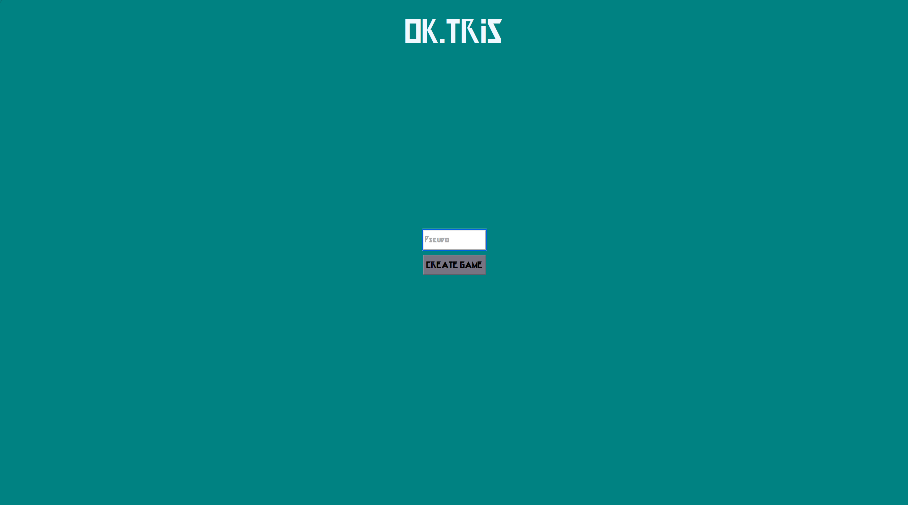
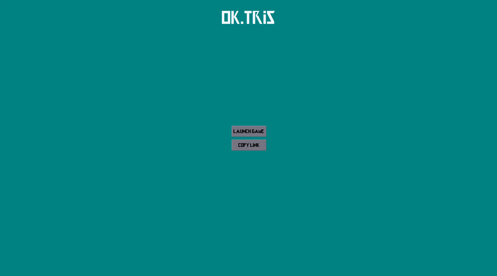
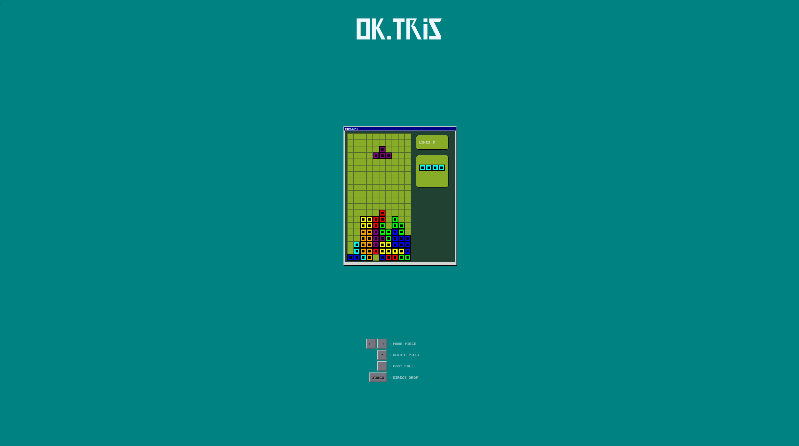
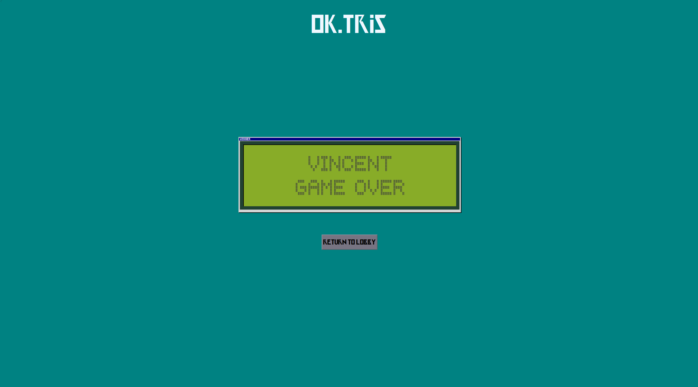
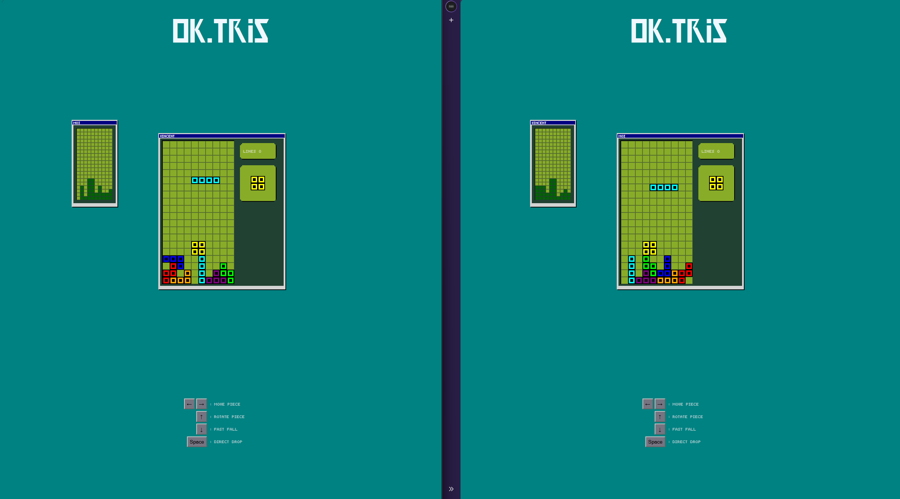

# red_tetris

> First project after the 42 common core: an online multiplayer **Tetris**.

## Overview

red_tetris is a real-time web game where several players can play Tetris together over the network. The server handles the game rooms and synchronizes players through WebSockets, while the client renders the game in the browser.

## Screenshots

<p align="center">
  
  
  
  
  
</p>

## Features

- **Online multiplayer**: play with other players in real time
- **Classic Tetris gameplay**: tetromino movement, rotation and line clearing
- **Shared piece generation**: all players in a game get the same pieces (bag system)

## Tech Stack

| Layer | Technology |
|-------|------------|
| Backend | Node.js (JavaScript), Express |
| Real-time | Socket.IO |
| Frontend | Vue 3 |

## Getting Started

### Prerequisites

- Node.js and npm

### Installation & run

```bash
git clone <repo-url>
cd red_tetris

npm install
npm start
```

## Architecture: pure functions

The game logic follows a functional approach. Pure functions handle **piece movement** and **piece generation**.

A pure function never modifies variables defined outside of itself: it only computes a result from its inputs and returns it.

**Example from the code:**

- `refillBag()` is **pure**: it computes the next list of pieces and returns it.
- `getNextTetromino()` is **not pure**: it is a getter that takes the values returned by `refillBag()` and applies them to the game state.

This separation keeps the core logic predictable and easy to test, while the side effects stay in a few well-identified places.

## Context

Built as part of the [42](https://42.fr) curriculum.
